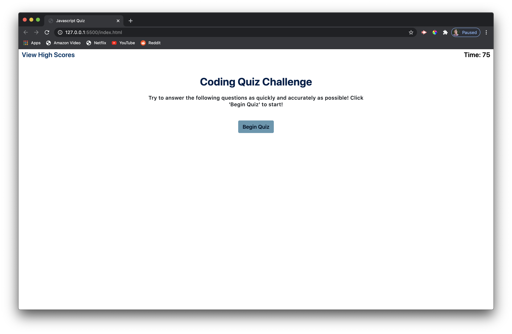

# Javascript Quiz #

[How to Play](#How-to-Play)\
[Features](#features)

This javascript quiz was created to test my own javascript skills while at the same time testing my knowledge of javascript trivia. Although I created the quiz for myself, I've made it very easy to change or add questions to the quiz. The quiz works by running you through a series of multiple choice questions while running a countdown from 75 seconds. Your overall score is based on how many seconds you have left once the quiz is completed.

[Take the Quiz Here!](https://ntkonzen.github.io/Javascript-Quiz/)

### How to Play ###

1. To begin the quiz, press the 'Begin Quiz' button
1. You'll be presented with a multiple choice question. Read through all the possible answers and click the one you believe to be correct.
1. If you answered correctly, you'll be moved to the next question
1. If you answered incorrectly, you'll be moved to the next question but a predetermined amount of seconds will be removed from the timer
1. If you answer too many questions incorrectly or take too long to finish the quiz, the game will end and you will not be allowed to log your score.
1. If you answer enough questions correctly before the clock runs up, you will be prompted to log your score with your intitials 
1. While the quiz is not running, you may click the 'View High Scores' button in the top left corner to view the logged high scores
1. You may also clear the high scores at any time

## Features ##

* A versatile toggle function that can be used for testing the program
  * To use, enter the toggle() function with the argument being the id of the intended screen you are trying to toggle
* A High Scores table that orders itself from the top down by score
* A set of questions that can be added to or manipulated easily 
  * To add a questions, copy the last section tag with the class 'question' and paste it below said section tag
  * change the id to whatever you prefer
  * Update the question and possible to answers to anything you like
  * Make sure the onClick attribute outputs the correct argument correspondant to the correct answer

---
Copyright (c) 2020 Konzen, Nicholas

Permission is hereby granted, free of charge, to any person obtaining a copy
of this software and associated documentation files (the "Software"), to deal
in the Software without restriction, including without limitation the rights
to use, copy, modify, merge, publish, distribute, sublicense, and/or sell
copies of the Software, and to permit persons to whom the Software is
furnished to do so, subject to the following conditions:

The above copyright notice and this permission notice shall be included in all
copies or substantial portions of the Software.

THE SOFTWARE IS PROVIDED "AS IS", WITHOUT WARRANTY OF ANY KIND, EXPRESS OR
IMPLIED, INCLUDING BUT NOT LIMITED TO THE WARRANTIES OF MERCHANTABILITY,
FITNESS FOR A PARTICULAR PURPOSE AND NONINFRINGEMENT. IN NO EVENT SHALL THE
AUTHORS OR COPYRIGHT HOLDERS BE LIABLE FOR ANY CLAIM, DAMAGES OR OTHER
LIABILITY, WHETHER IN AN ACTION OF CONTRACT, TORT OR OTHERWISE, ARISING FROM,
OUT OF OR IN CONNECTION WITH THE SOFTWARE OR THE USE OR OTHER DEALINGS IN THE
SOFTWARE.